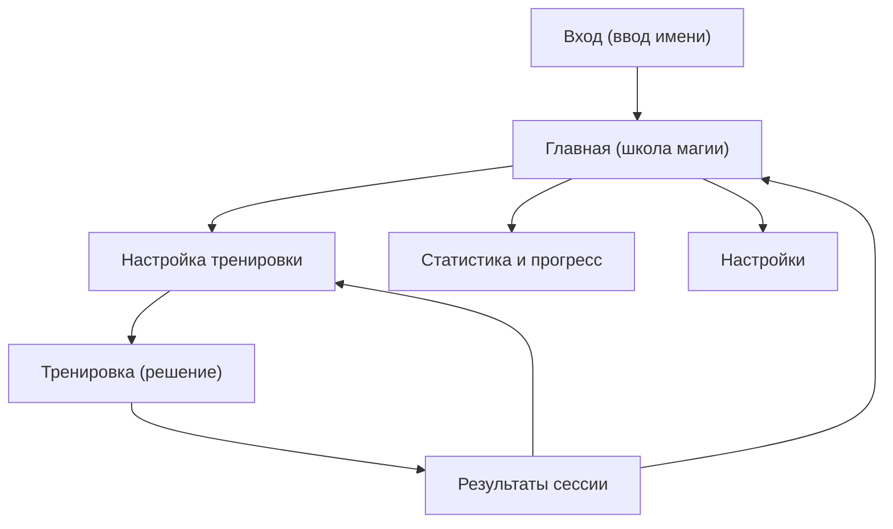

# Школа Магии Математики -- тренажёр для Майи

## Концепция

Капибары и пингвины поступили в школу магии, но у них проблемы с математикой! Майя -- лучшая ученица школы, которая помогает им решать "магические задачки" (примеры). За каждый правильный ответ Майя получает магические звёзды, открывает новые заклинания и помогает своим друзьям-капибарам и пингвинам пройти магические испытания.

---

## Технологический стек

- **React 19** + **TypeScript** + **Vite** -- быстрый билд, HMR

- **Tailwind CSS v4** -- стилизация

- **React Router v7** -- навигация между экранами

- **Zustand** -- лёгкий стейт-менеджер

- **IndexedDB** (через **idb**) -- надёжное хранение прогресса и настроек на iPad/Android (без бэкенда)

- **vite-plugin-pwa** (Workbox) -- Service Worker, офлайн, установка на планшет

- **Recharts** -- графики прогресса

- **Howler.js** -- звуковые эффекты

- **CSS Animations / Framer Motion** -- анимации персонажей

- **Vercel** -- бесплатный деплой

---

## Структура экранов



### Описание экранов

- **Вход** -- минимальная форма: ввести своё имя. Если имя уже есть в базе -- загружается профиль с прогрессом. Если новое -- создаётся новый профиль. Кнопка "Выйти" на главной для смены пользователя. Все данные (прогресс, звёзды, история) привязаны к имени.

- **Главная** -- приветствие от капибары-волшебника ("Привет, Майя!"), кнопки "Начать тренировку", "Статистика", "Настройки", отображение текущего уровня и звёзд

- **Настройка тренировки** -- выбор операции (или смешанный), сложности, конкретной цифры (для умножения/деления), количества примеров (5/10/15/20), включение таймера

- **Тренировка** -- показ примера, ввод ответа (клавиатура или варианты), маскот реагирует на ответы, прогресс-бар

- **Результаты** -- итоги: правильных/неправильных, список ошибок, заработанные звёзды, анимация

- **Статистика** -- графики прогресса по дням, слабые места (какие примеры чаще ошибаются), история сессий

- **Настройки** -- режим ввода (клавиатура/варианты), звук вкл/выкл, громкость, галочка "Тренировать отрицательные числа"

---

## Математическая логика

### Операции и уровни сложности

**Сложение / Вычитание:**

| Уровень | Диапазон чисел |

| ------------- | -------------- |

| Лёгкий | 0 -- 10 |

| Средний | 0 -- 50 |

| Тяжёлый | 0 -- 100 |

| Очень тяжёлый | 0 -- 1000 |

- Вычитание: по умолчанию результат >= 0 (первое число >= второго)

- **Настройка "Тренировать отрицательные числа"** (галочка в настройках): когда включена, вычитание может давать отрицательный результат, а также во всех операциях могут участвовать отрицательные числа

**Умножение:**

- Лёгкий: таблица 2-5

- Средний: таблица 2-9

- Тяжёлый: таблица 2-12

- Очень тяжёлый: двузначное x однозначное (13-25 x 2-9)

- Режим конкретной цифры: тренировка умножения на выбранное число (2-12)

**Деление:**

- Лёгкий: делители 2-5, результат целый

- Средний: делители 2-9, результат целый

- Тяжёлый: делители 2-12, результат целый

- Очень тяжёлый: делители 2-9, делимое до 100, результат целый

- Режим конкретной цифры: деление на выбранное число (2-12)

### Смешанный режим

Пользователь отмечает галочками нужные операции (минимум 2), примеры генерируются случайным образом из выбранных операций.

### Варианты ответов (режим выбора)

- Лёгкий / Средний: **4 варианта**

- Тяжёлый / Очень тяжёлый: **6 вариантов**

- Неправильные варианты генерируются "похожими" на правильный ответ (+-1, +-2, +-10) -- чтобы нельзя было угадать "на глаз"

---

## Геймификация

- **Магические звёзды** -- за каждый правильный ответ (1 звезда), бонус за серию правильных ответов подряд (streak)

- **Уровни** -- маг-ученик, маг-подмастерье, маг-мастер, великий маг и т.д. (по накоплению звёзд)

- **Маскот-капибара** -- реагирует анимацией: радуется при правильном ответе, грустит при неправильном, танцует при серии из 5+, одобрительно кивает

- **Друзья-пингвины** -- появляются на экране результатов, благодарят Майю

- **Достижения/бейджи** -- "Первая тренировка", "10 подряд", "Мастер умножения на 7", "100 звёзд" и т.д.

---

## Звуки

- Правильный ответ -- радостный звук (магическое "динь!")

- Неправильный ответ -- мягкий звук (не расстраивающий)

- Серия правильных (streak 3+) -- фанфары

- Завершение тренировки -- аплодисменты / магическая мелодия

- Фоновая музыка -- опционально, можно выключить в настройках

---

## Хранение данных (IndexedDB + idb)

Используем **IndexedDB** через библиотеку **idb** (обёртка с промисами) вместо localStorage:

- IndexedDB надёжнее сохраняется на iPad (Safari не удаляет данные PWA, установленных на экран)

- Позволяет хранить большие объёмы данных (история сессий, графики)

- Все данные привязаны к имени пользователя -- разные пользователи видят свой прогресс

### Многопользовательский режим

- При первом входе -- экран с полем "Как тебя зовут?" и список уже существующих профилей

- Имя сохраняется в текущей сессии, данные хранятся в IndexedDB с ключом `user:{имя}`

- Кнопка "Сменить пользователя" на главной странице

- Каждый профиль хранит свои настройки, прогресс, историю независимо

```typescript
interface UserProfile {
  name: string;

  settings: {
    inputMode: "keyboard" | "choices";

    soundEnabled: boolean;

    musicEnabled: boolean;

    negativeNumbers: boolean;
  };

  progress: {
    totalStars: number;

    level: number;

    achievements: string[];

    streak: number;

    bestStreak: number;
  };

  history: SessionResult[];
}

interface SessionResult {
  id: string;

  date: string;

  operations: OperationType[];

  difficulty: DifficultyLevel;

  totalQuestions: number;

  correctAnswers: number;

  timeSpent?: number;

  mistakes: MistakeRecord[];
}
```

---

## Структура файлов проекта

```

src/

  components/

    Mascot/           -- капибара-маскот (SVG + анимации)

    Question/         -- отображение примера

    KeyboardInput/    -- ввод с клавиатуры (вкл. экранную)

    ChoiceButtons/    -- варианты ответов

    ProgressBar/      -- прогресс тренировки

    StarsCounter/     -- счётчик звёзд

    AchievementPopup/ -- попап достижения

  pages/

    LoginPage/        -- экран входа (ввод имени)

    HomePage/         -- главный экран

    SetupPage/        -- настройка тренировки

    TrainingPage/     -- процесс тренировки

    ResultsPage/      -- результаты сессии

    StatsPage/        -- статистика и графики

    SettingsPage/     -- настройки

  engine/

    generator.ts      -- генерация примеров

    validator.ts      -- проверка ответов

    choicesGenerator.ts -- генерация вариантов ответов

    difficulty.ts     -- конфигурация сложности

  store/

    useAppStore.ts    -- Zustand стор

  db/

    database.ts       -- IndexedDB через idb, CRUD для профилей

  sounds/

    useSounds.ts      -- хук для звуков

  types/

    index.ts          -- TypeScript типы

  assets/

    sounds/           -- звуковые файлы

    images/           -- картинки персонажей

```

---

## PWA и офлайн

- `vite-plugin-pwa` с Workbox для кеширования всех ресурсов

- Манифест (`manifest.json`) с иконками, названием "Школа Магии Математики"

- Полная офлайн-работа -- все данные локальные, бэкенд не нужен

- Установка на iPad через Safari ("Добавить на экран"), на Android через Chrome

- Адаптивный дизайн: планшет (основной), телефон, десктоп

---

## Деплой

- **Vercel** -- бесплатный план, автодеплой из GitHub, поддержка PWA

- CI: push в main -> автосборка -> деплой

---

## Фазы разработки

### Фаза 1 -- Фундамент (каркас приложения)

Инициализация проекта (Vite + React + TS + Tailwind), роутинг, базовая структура компонентов, типы данных, Zustand стор.

### Фаза 2 -- Математический движок

Генератор примеров для всех операций и уровней сложности, генератор вариантов ответов, валидация, тренировка конкретных цифр, смешанный режим.

### Фаза 3 -- Основной UI тренировки

Экраны настройки и тренировки, ввод с клавиатуры и выбор из вариантов, прогресс-бар, логика 1 попытки + показ правильного ответа, опциональный таймер.

### Фаза 4 -- Визуал и персонажи

Капибара-маскот (SVG), пингвины, магическая тема (цвета, шрифты, фоны), анимации реакций маскота, адаптивный дизайн под планшеты.

### Фаза 5 -- Геймификация

Система звёзд и уровней, streak-бонусы, достижения/бейджи, попапы наград.

### Фаза 6 -- Звуки

Звуковые эффекты (правильный/неправильный ответ, фанфары), фоновая музыка, настройки звука.

### Фаза 7 -- Статистика и прогресс

Сохранение истории сессий, экран статистики с графиками, определение слабых мест.

### Фаза 8 -- PWA и деплой

Настройка Service Worker, манифест, иконки, тестирование офлайн-режима, деплой на Vercel.
